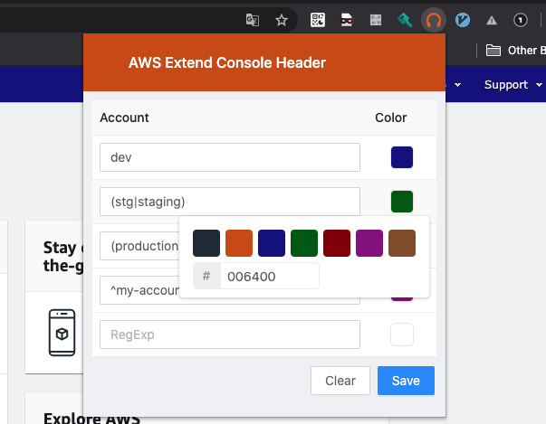

<h1 align="center">
   
    
    
  AWS Extend Console Header
   
   
</h2>

<h4 align="center">
Easily customize your AWS Console headers.
</h4>

## Feature

- change the color of the header using regular expressions.
- save your settings and synchronize them between devices.

## Install

[WIP] Chrome Web Store

## How to configure

