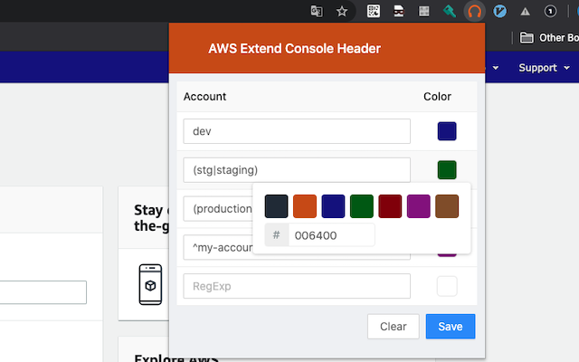

<h1 align="center">
   
    
    
  AWS Extend Console Header
   
   
</h2>

<h4 align="center">
Easily customize your AWS Console headers.
</h4>

## Feature

- change the color of the header using regular expressions.
- save your settings and synchronize them between devices.

## Installation

[Chrome Web Store](https://chrome.google.com/webstore/detail/aws-extend-console-header/liieekbljnaodacnhebgepdbbepbjkje)

## How to configure

